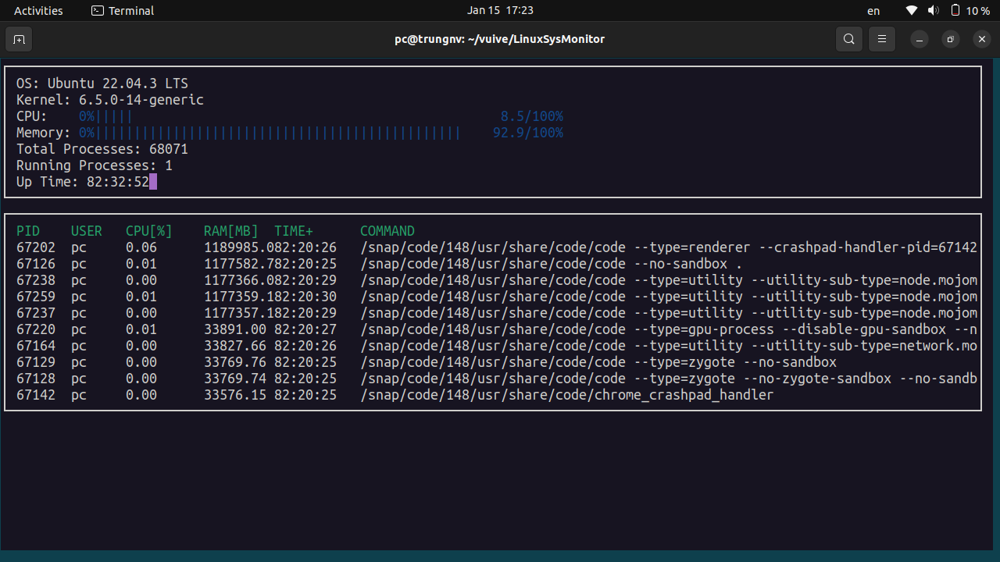

# System Monitor

> Developmet using C++17, Ubuntu 20.04 LTS, GNU Make and CMake >= 2.6

## Description
This is a simple version of a system monitor program that is simillar to [htop](https://en.wikipedia.org/wiki/Htop. This small project capitalize on creating multiple classes and header files that parse, maniplate, and then display linux system information that can mostly be found in the `/proc` directory on the linux distributions.
## ncurses
[ncurses](https://www.gnu.org/software/ncurses/) is a library used in this project that facilitates text-based graphical output in the terminal.

Install ncurses within your own Linux environment: `sudo apt install libncurses5-dev libncursesw5-dev`

## Instructions for building boilerplate version

1. Clone the project from this repository

2. Build the project: ```make build```

3. Run the executable: `./build/monitor`

4. Finally, implement the `System`, `Process`, and `Processor` classes, as well as functions within the `LinuxParser` namespace.

## Instructions for compiling the completed program from source

1. Install or update ncurses: `sudo apt install libncurses5-dev libncursesw5-dev`

2. Install [GNU Make](https://www.gnu.org/software/make/) and [CMake](https://cmake.org)

3. Git clone this repository: `git clone https://github.com/James1515/SystemMonitor.git`

4. Build the project: `make build`

5. Run the program with `./build/monitor` or from the build directory `./monitor`

You should then see a program result as the one below:


## Running Status for Ubuntu 20.04


